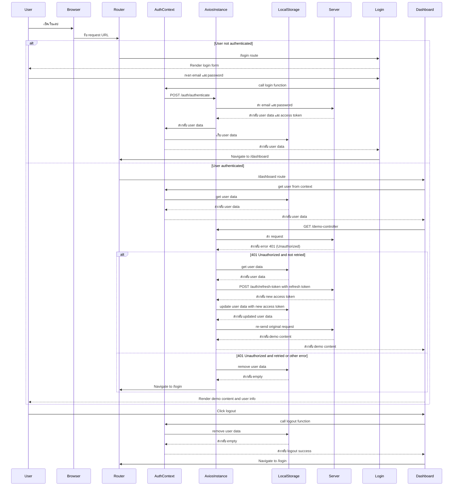

# Poc login with jwt 

## Require 

- mysql 
  - run mysql and create schema jwt_security
  ```
    docker compose up   
  ```
  - remove docker mysql
  ```
    docker compose down
    docker volume rm mysql_mysql_data
  ```

- frontend (fe-react-jwt)

   ```
   npm create vite@latest fe-react-jwt --template react
   cd fe-react-jwt 
   npm install axios react-router-dom
   ```

- backend (spring-boot-jwt)

# FrontEnd Diagram
