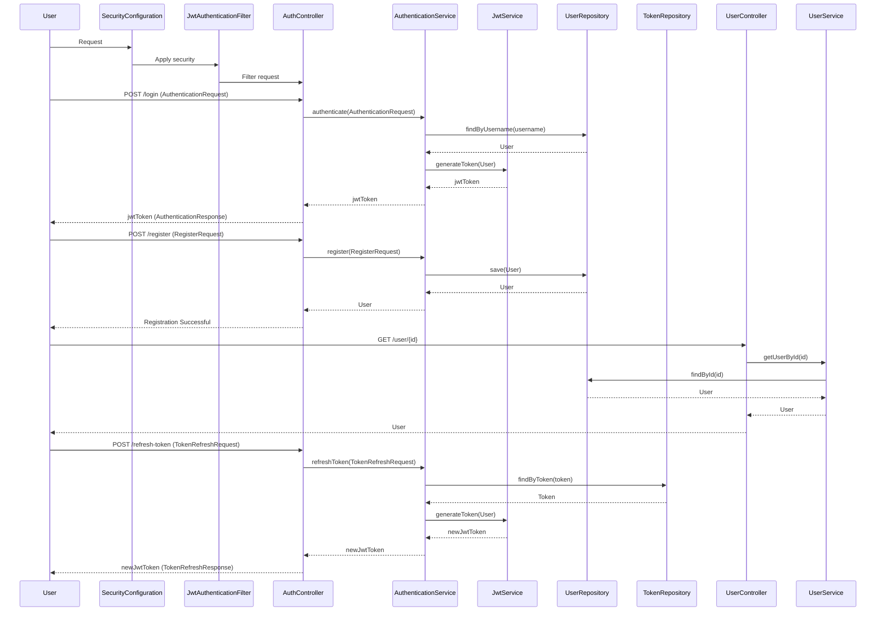

# Sequence Diagram

```mermaid
sequenceDiagram
    participant User
    participant SecurityConfiguration
    participant JwtAuthenticationFilter
    participant AuthController
    participant AuthenticationService
    participant JwtService
    participant UserRepository
    participant TokenRepository
    participant UserController
    participant UserService

    User ->> SecurityConfiguration: Request
    SecurityConfiguration ->> JwtAuthenticationFilter: Apply security
    JwtAuthenticationFilter ->> AuthController: Filter request

    User ->> AuthController: POST /login (AuthenticationRequest)
    AuthController ->> AuthenticationService: authenticate(AuthenticationRequest)
    AuthenticationService ->> UserRepository: findByUsername(username)
    UserRepository -->> AuthenticationService: User
    AuthenticationService ->> JwtService: generateToken(User)
    JwtService -->> AuthenticationService: jwtToken
    AuthenticationService -->> AuthController: jwtToken
    AuthController -->> User: jwtToken (AuthenticationResponse)

    User ->> AuthController: POST /register (RegisterRequest)
    AuthController ->> AuthenticationService: register(RegisterRequest)
    AuthenticationService ->> UserRepository: save(User)
    UserRepository -->> AuthenticationService: User
    AuthenticationService -->> AuthController: User
    AuthController -->> User: Registration Successful

    User ->> UserController: GET /user/{id}
    UserController ->> UserService: getUserById(id)
    UserService ->> UserRepository: findById(id)
    UserRepository -->> UserService: User
    UserService -->> UserController: User
    UserController -->> User: User

    User ->> AuthController: POST /refresh-token (TokenRefreshRequest)
    AuthController ->> AuthenticationService: refreshToken(TokenRefreshRequest)
    AuthenticationService ->> TokenRepository: findByToken(token)
    TokenRepository -->> AuthenticationService: Token
    AuthenticationService ->> JwtService: generateToken(User)
    JwtService -->> AuthenticationService: newJwtToken
    AuthenticationService -->> AuthController: newJwtToken
    AuthController -->> User: newJwtToken (TokenRefreshResponse)

```